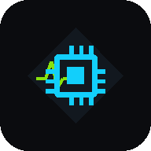

# SYS V — System Process & Memory Map Viewer

A developer-grade Android app that surfaces **live, on-device telemetry** — CPU, memory, thermal, battery and process/thread activity — using real Android platform APIs (no root, no fake data). Built with **Jetpack Compose** and **Kotlin**.

<p align="center">
  
</p>

## Features

- **Animated splash screen** — CPU chip pulses, telemetry waveform draws in, "SYS V" wordmark fades in.
- **Home dashboard** — device telemetry with a live **OK / WARNING / ERROR** status badge driven by real thresholds (CPU, RAM, temperature, thermal state, battery level/temp).
- **Memory Map / Analytics** — memory distribution donut, allocation history dual-line chart, and top memory consumers.
- **Threads** — running threads/processes for the app scope (Android 8.0+ restricts system-wide enumeration for unrooted apps).
- **Search** — live process filtering, recent activity, quick filters, and diagnostic tools.
- **Hardware Diagnostics** — checks device capabilities via `PackageManager.hasSystemFeature` (camera, fingerprint, NFC, GPS, sensors, Vulkan, …) and enumerates all sensors via `SensorManager`, showing a supported/unsupported report.
- **Profile** — engineer profile, monitoring preferences, and customizable **System** screens:
  - **Security & Privacy** — access control & data privacy toggles.
  - **Cloud Sync Status** — sync preferences.
  - **Display & Text Size** — app-wide text scaling (Small → Extra Large) via `LocalDensity` font scaling.

## Tech Stack

| Layer | Technology |
| --- | --- |
| UI | Jetpack Compose + Compose Canvas (real-time charts, custom icon/splash) |
| Language | Kotlin |
| Telemetry | `ActivityManager`, `Debug.MemoryInfo`, `BatteryManager`, `PowerManager` thermal API, sysfs (`cpufreq` / `thermal_zone*`), `SensorManager`, `PackageManager` |
| Architecture | `TelemetryRepository` polling into a `StateFlow`, consumed by Compose via `collectAsState()` |

## Telemetry Sources

- **CPU load** — `Process.getElapsedCpuTime()` sampling.
- **Memory** — `ActivityManager.MemoryInfo` + `Debug.MemoryInfo` (Java heap, native heap, graphics, system).
- **Battery** — sticky `ACTION_BATTERY_CHANGED` + `BatteryManager` (level, current draw, temperature).
- **Thermal** — `PowerManager.addThermalStatusListener()` (API 29+) and `/sys/class/thermal/thermal_zone*`.
- **Per-core frequency/temperature** — `/sys/devices/system/cpu/*/cpufreq`.

> **Android 8.0+ note:** Unrooted apps cannot enumerate other apps' PIDs/proc entries, so process/thread views are scoped to the app's own process. This is surfaced honestly in the UI.

## Project Structure

```
app/src/main/java/com/example/systemprocess/
├── MainActivity.kt                 # All screens, navigation, composables, splash, icon canvas
└── telemetry/
    ├── TelemetryModels.kt          # UI state + data models
    └── TelemetryRepository.kt      # Real system telemetry collector (1s polling)
```

## Build & Run

```bash
./gradlew :app:assembleDebug
```

The debug APK is produced at `app/build/outputs/apk/debug/app-debug.apk`.

Requires Android Studio (bundled JDK) and an Android device/emulator running API 26+.

## License

For educational/demo use.
